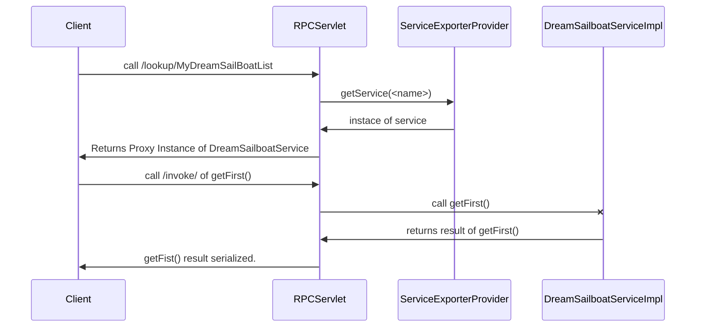

# Welcome to `pw-rpc-service-exporter`

The `pw-rpc-service-exporter` enables your Web Application to Publish Java Services to Java Client´s over HTTP.

# Get Started
If you have a Web Application that has a DreamSailBoatList Service, and you want to share this Service with other Java Web App (Swing or other Web-App). You will need to do some Steps.

## On Server Side
### Step 1 - Implements your Service Bean
#### Define the Sevice Public Interface. For eg. `DreamSailboatListService`

    public interface DreamSailboatService {
    
    	public List<String> getBoatList();
    	
    	public String getFirst();
    	
    	public void addAt(String boat, int index);
    
    }
####  Service Implementation `DreamSailboatServiceImpl`

    public class DreamSailboatServiceImpl implements DreamSailboatService {
    
    	private List<String> sailboatList;
    
    	public DreamSailboatServiceImpl() {
    		this.sailboatList = new ArrayList<>();
    		sailboatList.add("Gunboat");
    		sailboatList.add("Amel-60ft");
    		sailboatList.add("Sirius-DS-40ft");
    	}
    	
    	@Override
    	public List<String> getBoatList() {
    		return sailboatList;
    	}
    
    	@Override
    	public String getFirst() {
    		if(sailboatList.isEmpty()) {
    			return null;
    		}
    		return sailboatList.get(0);
    	}
    
    	@Override
    	public void addAt(String boat, int index) {
    		sailboatList.add(index, boat);
    	}
    }

### Step 2 - Implementation of the `ServiceExporterProvider`
This is a Class that knows how to get a Instace of a Service on your App. Here you can do EJB Lookup,s or simple do a new as below.

    public class MyServiceExporterProvider implements ServiceExporterProvider {
    	@Override
	public List<ExportedService> getExportedServices() {
		return serviceMap.values().stream().collect(Collectors.toList());
	}
	
	@Override
	public List<ExportedService> getExportedServices() {
		
		ArrayList<ExportedService> services = new ArrayList<ExportedService>();
		services.add(new SimpleExportedService("MyDreamSailBoatList", new DreamSailboatServiceImpl()));
		
		return services; 
		
		return serviceMap.values().stream().collect(Collectors.toList());
	}

	@Override
	public Object getService(String serviceName) {
		if(serviceName.equals("MyDreamSailBoatList")) {
			return new DreamSailboatServiceImpl();
		}
		return null;
	}

### Step 3 - Implementation of the  `AbstractRPCServiceServlet` 

#### Create the Servlet Class
    public class RPCServiceServlet extends AbstractRPCServiceServlet {
		private static final long serialVersionUID = 5610644570034789146L;
    }

#### Annotate the Servlet with some Parameters

    @WebServlet(urlPatterns = { "/describe/*", "/lookup/*", "/invoke/*" }, // 		initParams = { //
    				@WebInitParam( //
    						name = AbstractRPCServiceServlet.INIT_RPC_SERVICE_EXPORTER_PROVIDER, //
    						value = "rpc.service.exporter.test.webapp.service.provider.MyServiceExporterProvider"), //
    				@WebInitParam(name = AbstractRPCServiceServlet.INIT_LOOKUP_PATH, value = "/lookup"), //
    				@WebInitParam(name = AbstractRPCServiceServlet.INIT_DESCRIBE_PATH, value = "/describe"), //
    				@WebInitParam(name = AbstractRPCServiceServlet.INIT_INVOKE_PATH, value = "/invoke") // 		}// ) @MultipartConfig public class RPCServiceServlet extends AbstractRPCServiceServlet {

 - The `AbstractRPCServiceServlet.INIT_LOOKUP_PATH` defines the Service Lookup Path. Path to retrive the Service Object/Bean
 - The `AbstractRPCServiceServlet.INIT_DESCRIBE_PATH` defines the Service Describe Path. Description of the Services Publishied
 - The `AbstractRPCServiceServlet.INIT_INVOKE_PATH` defines the Service Invoke Path. This path receives the Invocations to the Service Beans.
 - The `@MultipartConfig` defines that the Servlet will receives `multipart/form-data`. See javadoc for more informations.
 - The `AbstractRPCServiceServlet.INIT_RPC_SERVICE_EXPORTER_PROVIDER` defines the Service provider class name. The Service Provider is a Extension of `ServiceExporterProvider`

## On Client Side (Swing App, or dependent Web-App)
For exemple a Client Test Case

    @Test
    public void testCallMyDreamSailingBoatService() throws IOException, URISyntaxException {
    	final String LOOKUP_ENDPOINT = "http://localhost:8080/rpcServiceExporterTest/lookup/MyDreamSailBoatList";
    	
		DreamSailboatService service = RPCLookupService.lookup(LOOKUP_ENDPOINT);

		String first = service.getFirst();

		assertEquals("Gunboat", first);

    }

## Sequence diagrams

You can render UML diagrams using [Mermaid](https://mermaidjs.github.io/). For example, this will produce a sequence diagram:

